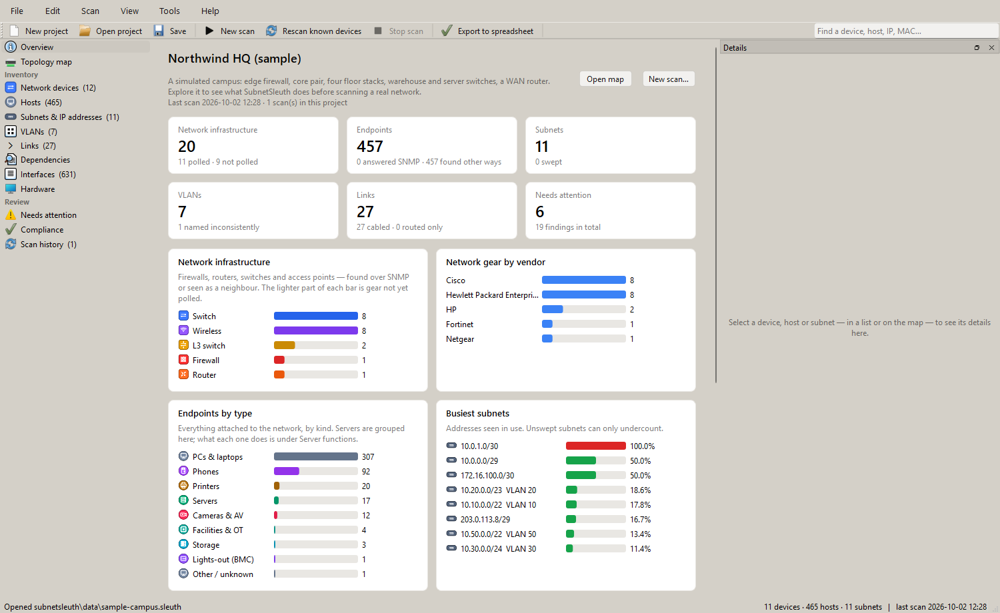
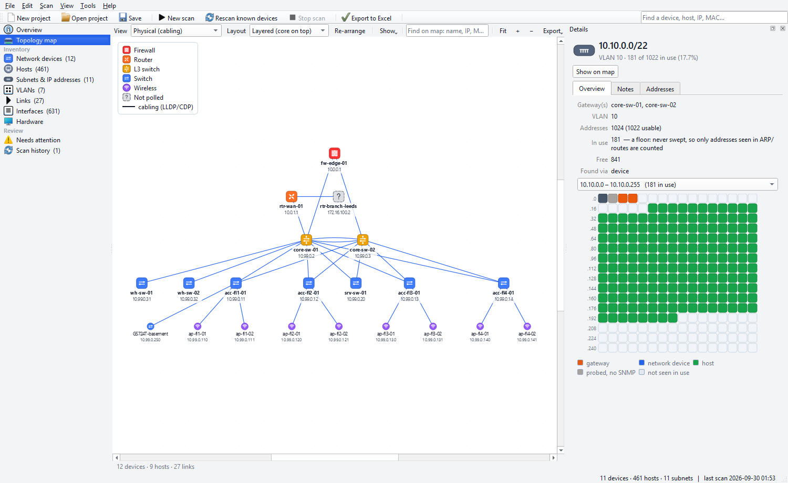
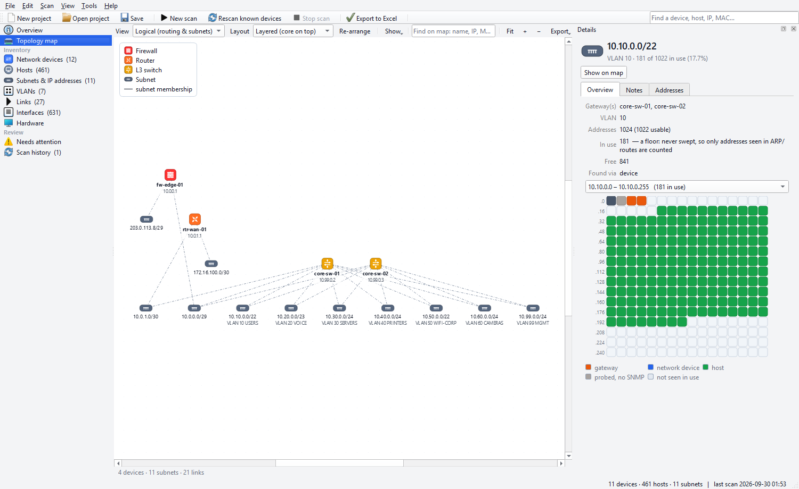
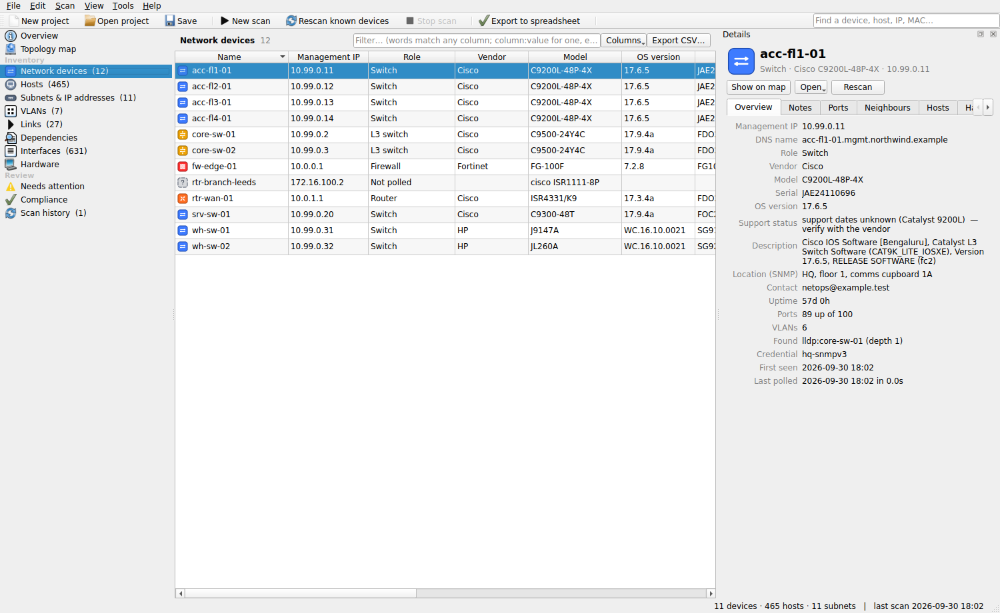
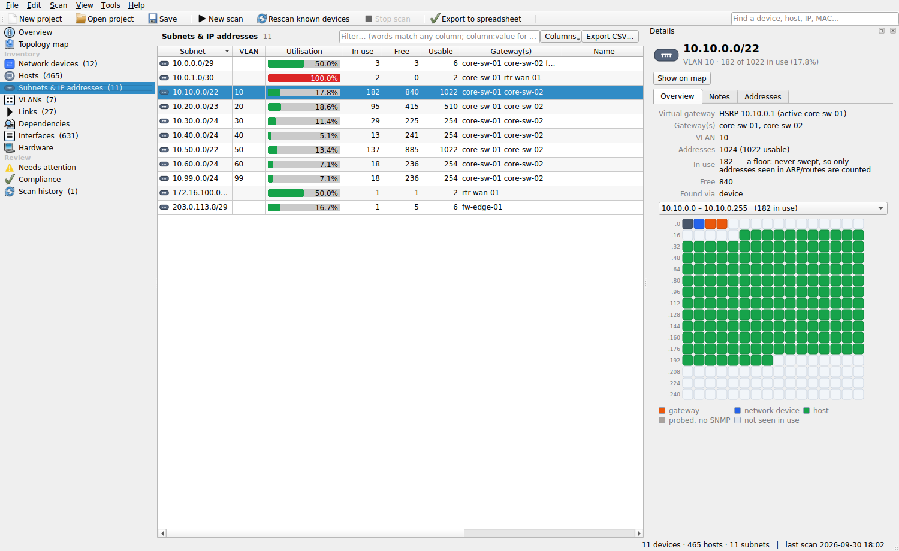
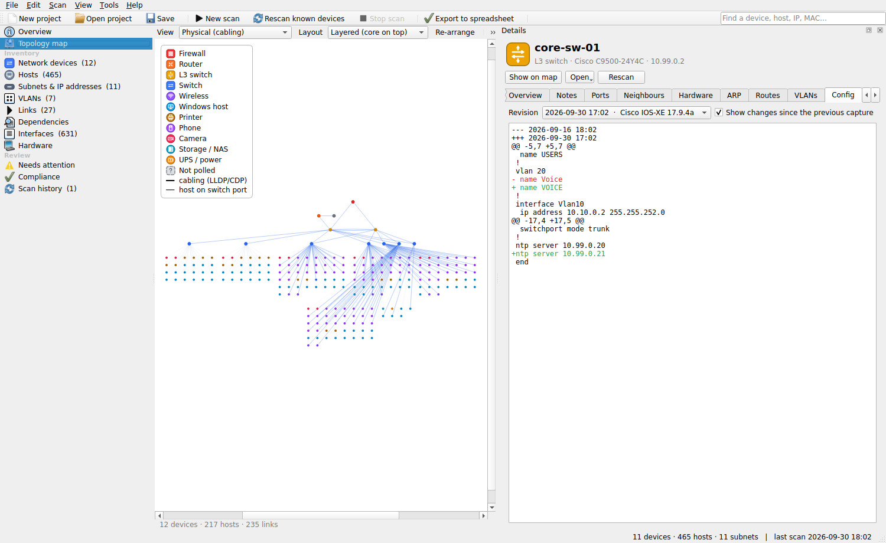
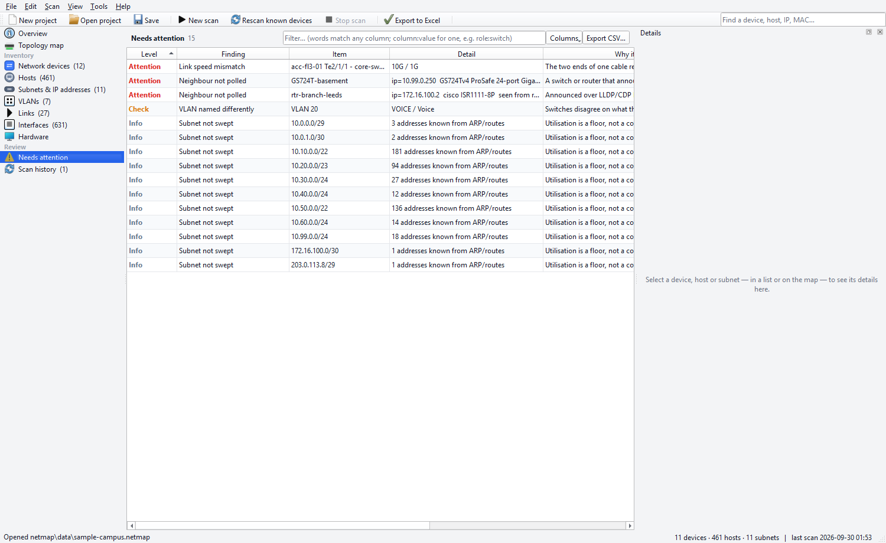
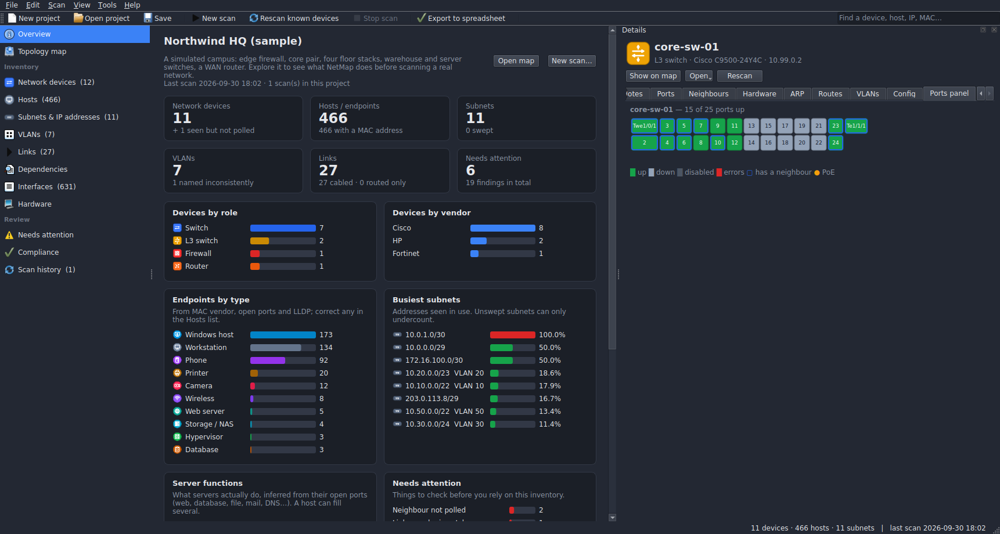

# NetMap

Inventory a network you look after — especially one you did not build — and see how it is wired.

NetMap reads the network's own devices over SNMP (read-only) and works out what is there and how it
connects: LLDP and CDP neighbours, routing tables, ARP and MAC address tables, VLANs, interfaces and
hardware. The result is an inventory (devices, hosts, subnets, VLANs, links, interfaces, serial numbers)
and a topology diagram, which you can document as you go, keep current with rescans, check against
the asset list you were handed, and export as an `.xlsx` workbook, a draw.io diagram (which converts
to `.vsdx`), PDF or CSV.

It comes as a **Windows desktop app** and as a **command-line tool** that share one project file.



The screenshots in this README are refreshed for each release from the frozen Windows build's self-test
run in CI (`tools/refresh_screenshots.py`), so they show the app as shipped.

## Download

From the [latest release](https://github.com/kerbe42/netmap/releases/latest):

| File | What it is |
|---|---|
| `NetMap-<version>-setup.exe` | The desktop app, installed for your user account (no administrator rights needed). Start menu entry, optional desktop shortcut, opens `.netmap` files. |
| `NetMap-<version>-portable.zip` | The same app as a folder: unzip anywhere (a USB stick, a jump host) and run `NetMap.exe`. Keeps its settings in that folder. |
| `netmap-<version>-win-x64.exe` | The command line as a single file, no Python needed. |
| `netmap-<version>-linux-x64` | The command line for Linux (x86-64). Built on Ubuntu 22.04, so it needs glibc 2.35 or newer: Ubuntu 22.04+, Debian 12+, RHEL / Rocky / Alma 9+ and their contemporaries. |

Check a download against `SHA256SUMS.txt`: on Windows `Get-FileHash .\NetMap-<version>-setup.exe -Algorithm SHA256`
and compare; on Linux `sha256sum -c SHA256SUMS.txt --ignore-missing` in the download folder.
The binaries are built by this repository's GitHub Actions workflow and are not code-signed, so SmartScreen
may ask for confirmation the first time.

To see what NetMap does before pointing it at anything, open **Help ▸ Explore the sample network**: a
simulated campus with a firewall, a core pair, floor and warehouse switches, a server room and about 500
endpoints.

## The desktop app

### 1. Credentials

**Scan ▸ SNMP credentials**: add the read-only SNMPv2c community or SNMPv3 user (SHA/SHA-2 and AES) for
the devices, and use *Test against a device* to check one. Credentials are tried in order on every
device and the one that worked is recorded against it. Secrets are encrypted with your Windows account
(DPAPI) and are never written into project files, so a project can be handed to someone else safely.

### 2. Scan

**Scan ▸ New scan** (Ctrl+R):

* **Address ranges to inventory** — the subnets you are responsible for, pasted as they come: CIDR,
  single addresses, or ranges like `10.20.0.10-60`, one per line or comma separated. Every live address in
  them is checked.
* **Start from devices** (optional) — a core switch or router. NetMap follows LLDP/CDP neighbours, routing
  next-hops and subnet gateways outwards from it.
* **Never touch** — ranges that must not be sent anything (OT, medical, partner links).

Nothing outside the ranges you gave is ever contacted; the dialog shows exactly what will be before you
start. If ping is blocked, choose *Query every address with SNMP*. Tick *Ping-sweep every subnet* for exact
address counts, and *Name devices and hosts from reverse DNS* to pick up PTR names.

Results appear while the scan runs. **Stop** keeps everything found so far. When the project has been
saved, it is saved again automatically at the end of every scan.

### 3. Understand it

**Topology map** — two views of the same network:

* **Physical** — what is cabled to what, from LLDP/CDP: firewalls and routers on top, then the core, then
  access switches, access points and anything announced but not polled. Turn on *Hosts* to see every
  endpoint on the switch port it is plugged into.
* **Logical** — how it routes: routers, L3 switches and firewalls with the subnets they have addresses in,
  each labelled with its VLAN.



Drag devices to tidy the diagram; positions are saved in the project for each view. Right-click a device
to focus on its neighbourhood, open its web page, SSH to it, ping it or rescan it. Port names are shown at
both ends of every cable. *Layout* switches between layered, organic and radial arrangements.



**Lists** — network devices, hosts (with the switch, port and VLAN each one is on), subnets with an IP
address map, VLANs (with every name each switch gives them), links with speeds at both ends, every
interface (status, speed, VLAN, access/trunk, LAG, neighbour, MACs learned), and hardware: chassis, stack
members, modules, power supplies, fans and transceivers with serial numbers. Filter any list with words, or
`column:value` — `role:switch vendor:cisco`, `vlan:20`, `status:down`. Select anything for its details.







**Needs attention** — what to look at before relying on the inventory:

| Finding | Usually means |
|---|---|
| Neighbour not polled | A switch, router or AP announces itself over LLDP/CDP but no credential works: unmanaged, or missing from the handover |
| Link speed mismatch | The two ends of one cable report different speeds: a negotiation problem or a wrong patch |
| VLAN named differently | Switches disagree on what a VLAN is for |
| Address seen with several MACs | A first-hop redundancy address, a recent hardware swap, or an address conflict |
| Subnet with no gateway found | The router for a range you listed was not reached |
| Address outside every known subnet | In use, but in no subnet any device reported: missing from the address plan |
| Starting device did not answer | A device you named as a starting point: wrong address or credentials, or SNMP filtered |
| Next-hop router not polled | Traffic is routed through it but no credential worked |
| Device stopped answering | It answered before and was silent on the last rescan |
| Subnet not swept | Its utilisation is a floor, not a count |



### 4. Document it

Select a device, host, subnet or VLAN and open the **Notes** tab in the details panel: name, role, site,
owner, asset tag, status (*Verified*, *Needs review*, *Unknown owner*, *To be replaced*, …), tags and free
notes. They are saved in the project, never overwritten by a rescan, shown on the map and in the lists,
and included in the workbook export. A role you set corrects a wrong automatic guess everywhere.

### 5. Keep it current

* **F5** re-polls every known device and follows any new links.
* Right-click a device ▸ *Rescan this device*, or a subnet ▸ *Find every live address in this subnet*.
* **Tools ▸ Compare with another scan** lists devices added, removed, moved (same serial, new address) or
  changed (model, serial, OS version, ports up/down, reboots), links and VLANs added or removed, and hosts
  that appeared, vanished or changed MAC address.
* **Scan history** records every scan: what was asked, how long it took, what it found.
* **Tools ▸ Check against an asset list…** compares the project with the device list you were given (a CSV or
  `.xlsx` file; the address, name, serial and MAC columns are recognised from their headers) and reports what
  was *found*, *found but different* (another model, serial or address), *not found*, and what is on the
  network but *not in the list*. The command line does the same: `netmap check -m site.netmap assets.xlsx --csv differences.csv`.
* **Tools** (bottom panel): ping, traceroute, DNS (with a forward/reverse consistency check) and an SNMP
  test against any address.

### 6. Share it

**File ▸ Export**:

| Export | Contents |
|---|---|
| `.xlsx` workbook | Summary, Devices, IPAM, VLANs, Links, Hosts, Interfaces, Hardware and Gaps sheets, with your notes |
| draw.io diagram | Physical and logical pages with your layout, network-style icons and port labels. Opens in [diagrams.net](https://app.diagrams.net) (desktop or web), which can save it as `.vsdx` |
| Map as PDF / SVG / PNG / Print | The current view as you arranged it |
| Interactive HTML map | One offline web page anyone can open in a browser |
| CSV files, GraphML, DOT | For scripts, graph tools that read GraphML, Graphviz |

Every list also exports what it shows (after filtering) with *Export CSV*, and Ctrl+C copies the selected
rows in a form that pastes straight into a spreadsheet.

### Settings and files

* The project (`.netmap`) is a single JSON file holding the inventory, your notes, map layouts and scan
  history — never credentials (see *Project file format* below).
* Settings live in the registry under `HKCU\Software\netmap\NetMap`, or beside the program in the portable
  build. The log is `%LOCALAPPDATA%\NetMap\netmap.log` (**Help ▸ Open the log folder**).
* **View ▸ Theme**: follow Windows, light or dark.



### Project file format

A `.netmap` file (or `.json`; the command line's `--out` accepts either) is plain UTF-8 JSON, so it diffs,
greps and goes into version control. Top-level keys:

| Key | Holds |
|---|---|
| `meta` | `version` (the format version, currently `2`; older files are upgraded on load) and `created` |
| `devices` | everything polled over SNMP, keyed by management address: system group, interfaces, neighbours, routes, ARP, MAC table, VLANs, hardware components, identification evidence, open ports |
| `hosts` | endpoints that did not answer SNMP, keyed by address: MAC, names, switch/port/VLAN, profile and evidence, inspection facts |
| `subnets` | prefixes from interface addresses and sweeps: gateway, VLAN, members, utilisation |
| `annotations` | your notes per device/host/subnet/VLAN: name, role, site, owner, asset tag, status, tags, free text |
| `layout` | node positions per map view |
| `history` | one record per scan: request, duration, counts |
| `configs` | captured device configurations with their revision history |
| `dhcp_scopes` | scopes folded in from a DHCP import |
| `unreachable`, `project` | addresses that never answered; project-level settings such as the name and the last scan's request |

Credentials are never in the file. The desktop app and the command line read and write the same format.

## What it collects per device

| Source (SNMP) | Gives you |
|---|---|
| system group | name, description, vendor, OS version, location, contact, uptime |
| ENTITY-MIB | model and serial, plus stack members, modules, power supplies, fans and transceivers with serials, revisions and FRU flag |
| IF-MIB, ipAddrTable | interfaces, speeds, MACs, descriptions, last status change, IPs and subnets |
| LLDP-MIB, CISCO-CDP-MIB | Layer-2 links, with local and remote port names and neighbour management addresses |
| ipCidrRouteTable / ipRouteTable | routes and next-hops (Layer-3 adjacency, new subnets to explore) |
| ipNetToMediaTable | ARP: every IP/MAC the device has talked to |
| BRIDGE-MIB / Q-BRIDGE-MIB | MAC forwarding table: which switch port each host sits on, per VLAN |
| Q-BRIDGE / CISCO-VTP-MIB | VLAN ids and names |
| Q-BRIDGE / CISCO-VLAN-MEMBERSHIP-MIB | each switch port's access or native VLAN, and whether it is a trunk |
| IEEE8023-LAG-MIB | which ports are bundled into which LAG / port-channel |

Hosts that do not speak SNMP still appear: from ARP, from LLDP/CDP announcements (phones, APs), from
reverse DNS, and from an optional `nmap` ping sweep with light service identification.

Every MAC address is matched against a bundled copy of the IEEE OUI registry, so a host known only from an
ARP table is still attributed to a manufacturer and typed, offline and without `nmap`. Types assigned:
router, l3switch, switch, firewall, wireless, server, vm, database, windows, workstation, printer, phone,
camera, nas, ups, host, and *unpolled* for something a neighbour announced that could not be polled. An
access switch is only called an L3 switch with evidence that it routes (addresses on more than one
interface, or learned routes), not because sysServices says so.

## Identifying hosts (profiling)

For endpoints that don't answer SNMP, NetMap profiles them from many weak signals weighed together, with
the evidence kept. Turn on **Identify hosts** in the scan (on by default);
it sends a few small **read-only** probes to each host and needs no admin rights or nmap:

| Probe | Gives you |
|---|---|
| NetBIOS (UDP 137) | Windows/SMB name, logged-on domain/workgroup, domain-controller role, and the host's real MAC (works across a router, so it fixes MACs nmap can't get) |
| mDNS / Bonjour (UDP 5353) | `.local` name and advertised services — printers (IPP), Apple AV (AirPlay), Chromecast, HomeKit, file shares |
| SSDP / UPnP (UDP 1900) | device description: manufacturer, model, friendly name, device type (media, gateway, NAS, camera) |
| HTTP / TLS banner | web-UI Server header and the TLS certificate CN/SAN — identifies appliances, cameras, NAS, iLO/iDRAC |
| SSH banner | the server's identification string (read-only, no auth) — names the distro/OS, e.g. `OpenSSH_8.2p1 Ubuntu`, even on a no-privilege field laptop |
| nmap (optional) | open ports and service/version detection |

Device **model** is read from ENTITY-MIB, and — for the gear that leaves that blank (FortiGate, Palo Alto, MikroTik, Aruba, many Cisco access switches) — parsed from the sysDescr, so the model column is populated on far more real kit.

Every host ends up with a **role, OS, vendor, model and a confidence** (high/medium/low), and its details
carry a **Why** tab listing each signal, what was seen, and what it implies — so you can trust or correct
the verdict. The best name is chosen from DNS, NetBIOS, mDNS, SSDP and LLDP, and every other name it goes by
is kept as "also known as".

### Server functions from open ports

On top of the single role, NetMap reads a server's **open ports** to work out what it actually *does* — a
box can fill several jobs at once, so these are listed as **functions** (a column on the Hosts list, a row in
the details panel, and a **Server functions** breakdown on the overview):

| Ports | Function |
|---|---|
| 80 / 443 / 8080 / 8443 | Web server |
| 1433 / 3306 / 5432 / 1521 / 27017 / 6379 … | Database — named by engine from the port (relational, document and key-value stores) |
| 2049 / 548 (or SMB on a server OS) | File server |
| 25 / 465 / 587 / 143 / 993 / 995 | Mail server |
| 53 · 67 · 123 | DNS · DHCP · NTP (DNS and NTP are confirmed with small read-only UDP probes, since a TCP scan can't see them) |
| 389 / 636 / 3268 (+88) | Directory / domain controller |
| 515 / 631 / 9100 | Print server |
| 902 / 8006 / 6443 · 2375 | Virtualization host · containers |

Where the ports make it unambiguous, the primary **role** is sharpened too — a plain `server` becomes a
**web server, database, mail server, DNS server, domain controller, hypervisor** or **file server**, each with
its own icon on the map and lists. Client machines are not mistyped: every Windows PC exposes SMB and RDP, so
those alone never make it a "file server" — that needs NFS/AFP or a server operating system, and a host that
offers no real service is left as a plain endpoint. Filter or query on it like anything else, e.g.
`hosts where functions ~ "PostgreSQL"` or `type:database` in the Hosts search box.

## Routed topology

Beyond cabling, NetMap reads the things that decide how the network actually forwards, so you can
understand a routed estate you were handed:

* **First-hop redundancy (HSRP / VRRP)** — the *virtual* IP hosts really use as their gateway, and which
  router is active vs standby for it. A subnet's details show its virtual gateway, and a gateway with no
  standby is flagged.
* **Routing adjacencies (OSPF / BGP)** — each device's neighbours and whether they are up (OSPF *full*, BGP
  *established*), with the remote AS for BGP peers — the shape of the routed core.
* **Spanning tree** — the root bridge and this switch's root port, i.e. the active L2 forwarding shape, which
  can differ from the physical cabling.

## Path tracing

To understand how traffic actually reaches something, every device and host has a **Path** tab, and
right-clicking anything offers **Trace path to here**, which lights the path up on the map:

* the **switched path** follows LLDP/CDP cabling and the MAC-address tables — from the core, through the
  distribution and access switches, down to the exact port a host is on;
* the **routed path** is reconstructed from the collected routing tables hop by hop toward the destination
  (a traceroute rebuilt from SNMP, so it works even where ICMP is filtered), naming each router and egress.

## Interface health and PoE

Per-port counters turn into something you can act on. The Interfaces list shows each port's
**utilisation** (busiest direction, measured between two scans — rescan to populate it), **error**
counters and rate, **duplex**, and **PoE** status/class/watts; the device shows its PoE budget and
draw. Findings call out ports taking errors, half-duplex switch links, links running near saturation,
and a PoE budget nearly full.

## Configuration capture and change tracking

With device login credentials you can capture running-configs **read-only** over SSH (Cisco IOS/NX-OS,
Junos, EOS, FortiOS, ArubaOS-CX, ProCurve, RouterOS) — **Tools ▸ Capture device configs**, a device's
right-click menu, or `netmap capture -u USER`. Configs are stored in the project with a revision history,
and each device's **Config** tab shows the text or a coloured **diff against the previous capture**, so
you can see exactly what changed. NetMap only ever runs `show` commands; it never writes to a device.

## DHCP, syslog and traps

* **DHCP import** (**File ▸ Import ▸ DHCP leases / scopes**) reads an ISC/Kea `dhcpd.leases` or a Windows
  DHCP CSV export and folds it in — naming hosts, filling MACs, and marking which subnets are DHCP scopes.
* **Syslog / SNMP trap listener** (**Tools ▸ Listen**) is a passive receiver: point devices' logging and
  trap host at your machine and watch link flaps, auth failures and config-change messages arrive live,
  keyed to the device that sent them.

## Configuration checks and hardware support

* The **Compliance** page is a management-plane configuration review of the devices you inventoried, worked
  out from what the scan already collected: which SNMP version each device answered and whether a default
  community is in use, whether management is reachable over Telnet or cleartext HTTP (a light TCP check of
  the device's own address), spanning-tree root left at its default priority, access ports enabled with
  nothing connected, expired certificates on management web interfaces, and hardware past vendor
  end-of-support. Each item says what was found and the setting it should be brought to, so it doubles as
  a to-do list for the handover.
* **End-of-life / end-of-sale**: each device is matched against a bundled offline table of common platforms
  (`netmap/data/eol.json`) and shows its support status and the announced dates. The table is curated by
  hand and some entries match by family only, so always confirm a milestone against the vendor's notice for
  the exact part number.

## Servers, virtualization and dependencies

Beyond the network gear, NetMap can go deeper where you have credentials:

* **Agentless server inspection** (**Tools ▸ Inspect servers**, or `netmap inspect`): read-only SSH (Linux/Unix)
  and WinRM (Windows) collection of OS, hardware, installed software, running services and active connections.
  A host's details gain **System**, **Software** and **Connections** tabs.
  WinRM prerequisites on the Windows targets: the WinRM service listening (`winrm quickconfig` or the *Allow
  remote server management through WinRM* policy), TCP **5985** (HTTP) — or **5986** with a certificate for
  HTTPS — allowed through the host firewall from the machine running NetMap, and an account that is a local
  administrator (or in *Remote Management Users*). Authentication is **NTLM** by default; Kerberos works when the
  scanning machine is domain-joined and you give the account as `user@REALM`. Nothing is installed on the
  target and only `Get-*` / WMI queries are run.
* **Dependency mapping**: the connections collected become a **Dependencies** page and a per-host tab — which
  client talks to which server on what service (the server side inferred from the well-known port), the way an
  application-dependency map is built.
* **VMware discovery** (**File ▸ Import ▸ VMware**, or `netmap vmware`): read-only vCenter/ESXi discovery that
  folds ESXi hosts and VMs into the map with guest IPs/OS, the ESXi parent and port-group VLANs.
* **Switch faceplate**: a switch's **Ports panel** tab draws its ports as they sit on the front of the unit,
  coloured by up/down/disabled/errors, marking PoE ports and ports with a neighbour.

## Broad discovery (unauthenticated)

Beyond SNMP and the usual host probes, NetMap fingerprints assets across many protocols with no
credentials, as part of **Identify hosts**:

* **WS-Discovery** (printers, ONVIF cameras, Windows), **IPMI** (server lights-out/BMC controllers), and
  **OT/ICS**: **Modbus**, **BACnet** and **EtherNet/IP** — so industrial controllers, building-automation
  controllers and BMCs are found and typed (roles: PLC, building automation, BMC) with vendor/model where the
  protocol gives it.
* **Coverage gaps**: every private network the routing tables reference but the scan never reached is flagged
  ("Subnet not yet scanned"), so you can see and close what you have not covered.

## Query and automation

* **Query / search** (**Tools ▸ Query**, Ctrl+Shift+F): a small query language over the whole inventory —
  `hosts where os ~ windows and confidence = high`, `devices where role = switch order by name`,
  `interfaces where util > 80`, `hosts where port = 3389`. Tables: devices, hosts, subnets, vlans, links,
  interfaces, hardware, findings, compliance, dependencies.
* **REST API** (**Tools ▸ Start API server**, or `netmap serve`): a read-only JSON API on localhost — the
  inventory pages, individual objects, and `/query?q=…` — for scripts and integrations, with an optional token.
* **Scheduled scans**: **Scan ▸ Schedule automatic rescans** re-polls on an interval while the app is open;
  `netmap crawl --repeat SECONDS` does the same headless on a jump box.
* **Preferences** (**Edit ▸ Preferences**): set the default scan pace and limits once — including the **largest
  subnet to sweep/probe**, so scanning a /16 is a single setting — plus which steps run and the theme.

## Staying inside your ranges

Every step that sends a packet checks the same three lists first — the **scope**, the **target ranges** and
the **exclusions** — and the same rule applies to all of them: an address outside the scope, or inside an
exclusion, is never contacted, whichever step found it. This is what each step sends, and to whom:

| Step | Sends | To | Runs |
|---|---|---|---|
| SNMP polling | GET / GETBULK (read-only; NetMap never issues SET) | seeds, live addresses in the targets, and LLDP/CDP neighbours, next-hop routers and subnet gateways learned from them | always |
| Ping sweep | ICMP echo, or TCP connect to a few common ports where ICMP is blocked | every address in a target or swept subnet, capped at `--sweep-max-size` (default /22) | with *Ping-sweep every subnet* / `--sweep`, or before probing a target |
| Reverse DNS | PTR queries to **your** resolver, not to the hosts | your configured DNS server | with *Name from reverse DNS* / `--dns` |
| Host identification | one small request each: NetBIOS name query, mDNS, SSDP, WS-Discovery, HTTP/TLS handshake, SSH banner read, IPMI, Modbus, BACnet, EtherNet/IP, DNS and NTP checks | hosts and devices already found | with *Identify hosts* / `--identify` |
| Service scan | `nmap -sV` on the top ports (`--os` adds `-O`, which needs Administrator/root) | hosts and devices already found that answer a ping (a quick `nmap -sn` check first, unless `--no-ping-first`) | only with `--port-scan` / *Port scan* |
| Config capture, server inspection, VMware | SSH `show` commands, WinRM `Get-*` queries, vCenter API reads | the devices/hosts you selected, with credentials you supply | only when you start them |
| Syslog / trap listener | nothing — it only receives | — | only when you open it |

* Target ranges are always inside the scope; when no wider scope is given they *are* the scope. With neither,
  a scan is limited to RFC1918 space and says so. *Never touch* always wins, including inside a target.
  Loopback, link-local, multicast and 0/8 are never probed. The scan dialog lists what will be contacted
  before you start.
* Probing every address is capped (default: nothing larger than a /22 per range, `--sweep-max-size`) so a
  mistyped prefix cannot turn into tens of thousands of probes; the range is refused and it says so.
  `--max-devices` (default 5000) stops a crawl that keeps finding new devices.
* Everything is read-only. Nothing NetMap sends changes state on a device or host.
* Large networks: a sweep runs one `nmap` per /24 of each range (eight at a time), and the port scan only
  goes to addresses that answered a ping, in batches of 24. Each `nmap` run has a time limit (*Nmap time
  limit per run*, `--nmap-timeout`, default 30 minutes, 0 for none). A run that reaches it keeps every host it
  had finished, and the rest is tried once more with twice the time. A subnet whose sweep still did not
  finish is not marked swept, so the next sweep tries it again, and the log names any addresses the port
  scan could not finish.
* Pace: *Devices polled at once* (default 12, `--workers`), one SNMP walk at a time per device, GETBULK with
  25 repetitions. Lower it for fragile gear.

## Command line

The same scanner and the same project file, for scripting and scheduled runs. `netmap.exe` on Windows,
`netmap-cli.exe` inside the installed app's folder, or from source:

```bash
python3 -m venv .venv && .venv/bin/pip install -e .          # command line only
.venv/bin/pip install -e ".[gui]"                            # plus the desktop app (netmap-gui)
```

Requires Python 3.11+.

```bash
export NETMAP_COMMUNITY='their-ro-string'

# Inventory the ranges you are responsible for, and nothing else.
netmap crawl --target 10.20.0.0/24 --target 10.30.0.0/24 -C "$NETMAP_COMMUNITY" \
             --dns --out site.netmap --xlsx site.xlsx --drawio site.drawio

# The same list from a file (one subnet per line, '#' comments allowed).
netmap crawl --target-file ranges.txt -C "$NETMAP_COMMUNITY" --out site.netmap

# ICMP is filtered: skip the ping and try SNMP on every address in the targets.
netmap crawl --target 10.20.0.0/24 --probe-all -C "$NETMAP_COMMUNITY" --out site.netmap

# Spider outwards from a core device, bounded by --scope.
netmap crawl --seed 10.10.0.1 --scope 10.10.0.0/16 -C "$NETMAP_COMMUNITY" --out site.netmap

# Later: re-poll everything already in the project and follow new links; notes and layout are kept.
netmap crawl --resume --refresh --seed 10.10.0.1 --scope 10.10.0.0/16 -C "$NETMAP_COMMUNITY" --out site.netmap

# Go further than SNMP on the hosts found (each step stays inside the scope):
#   --dns        names from reverse DNS
#   --identify   small read-only identification probes (NetBIOS, mDNS, SSDP, HTTP/TLS, SSH banner, OT/BMC protocols)
#   --port-scan  nmap service/version scan of every device and host found
#   --os         nmap OS detection as well (needs Administrator / root)
netmap crawl --target 10.20.0.0/24 -C "$NETMAP_COMMUNITY" --dns --identify --port-scan --out site.netmap

# Guard rails: refuse to sweep anything larger than a /24, stop after 500 devices.
netmap crawl --target 10.0.0.0/16 -C "$NETMAP_COMMUNITY" --sweep-max-size 24 --max-devices 500 --out site.netmap

# A big estate (/16s across a WAN): allow /16 targets and give each nmap run up to an hour.
netmap crawl --target-file ranges.txt -C "$NETMAP_COMMUNITY" --sweep-max-size 16 --port-scan --nmap-timeout 60 --out site.netmap

netmap show   -m site.netmap                                      # text summary
netmap render -m site.netmap --xlsx site.xlsx --drawio site.drawio --csv out/site-   # outputs, no network
netmap sweep  -m site.netmap --subnet 10.10.50.0/24               # ping-sweep one more subnet
netmap diff   last-month.netmap site.netmap --csv changes.csv     # what changed
netmap check  -m site.netmap assets.xlsx --csv differences.csv    # reconcile with the asset list you were given
netmap gui    site.netmap                                         # open it in the desktop app
```

For anything repeatable, keep scope, exclusions and SNMPv3 credentials in a config file (see
`netmap.toml.example`). Any secret in it — community, v3 keys — can be written as `env:VARIABLE`, and the
value is read from that environment variable when the scan starts, so the file itself holds no secret:

```bash
export NETMAP_COMMUNITY='their-ro-string'      # the file says  community = "env:NETMAP_COMMUNITY"
netmap crawl -c site.toml --sweep --fingerprint --out site.netmap --xlsx site.xlsx
```

`ranges.txt` takes the range list as it arrives — one subnet or address per line, or several separated by
commas, with `#` comments:

```
# Head office, agreed 2026-09-20
10.20.0.0/24      # user VLANs
10.30.0.0/24, 10.31.0.0/24
192.168.5.10      # the one server in the DMZ we look after
```

### Outputs

| Option | Contents |
|---|---|
| `--out` (`.netmap` / `.json`) | the project: full inventory, notes, layouts, scan history; written after every device, so `--resume` continues an interrupted scan |
| `--xlsx` | `.xlsx` workbook: Summary, Devices, IPAM, VLANs, Links, Hosts, Interfaces, Hardware, Gaps |
| `--drawio` | draw.io diagram, physical and logical pages |
| `--html` | self-contained interactive map (works offline) |
| `--csv PREFIX` | devices, links, hosts, subnets, IPAM, VLANs, interfaces and hardware as CSV |
| `--graphml`, `--dot` | GraphML for graph tools, DOT for Graphviz |

**IPAM** counts addresses actually observed in use — device interfaces, ARP and bridge-table entries, sweep
replies — so utilisation is evidence, not an estimate. A subnet that was never swept is flagged, because
its count is a floor rather than a total.

## How the topology is worked out

* **Devices** are things that answered SNMP. Identity is by management IP, but a box reached again via
  another of its addresses is merged, not duplicated.
* **LLDP/CDP links** are matched to a known device by neighbour management address, chassis MAC or system
  name (domain-stripped). One link per port pair, whichever side reported it, with port names normalised
  (`GigabitEthernet1/0/2` = `Gi1/0/2`). A neighbour that could not be polled becomes an *unpolled* device,
  or, if its address answers in ARP, is attached to that host and typed from its LLDP capabilities.
* **Routing links** connect a device to the device owning its route next-hop. They are not drawn where a
  cable between the pair is already known.
* **Subnets** come from interface addresses; devices and hosts are members. Their VLAN comes from the SVI
  that holds the address.
* **Hosts on ports** come from MAC tables: a host is placed on the access port where its MAC was learned.
  Ports carrying an LLDP/CDP neighbour, or more than 8 MACs, are treated as uplinks and skipped.

## Running it well

1. Run it from a machine inside the network (a jump host or a laptop on the management VLAN): SNMP is
   almost always filtered at the edge.
2. Prove the credentials on one device first: *Test against a device* in the credential dialog, or the
   SNMP test in Tools.
3. Scan the ranges, with one or two core devices as starting points so LLDP/CDP fills in the wiring
   between them. Tick *Ping-sweep every subnet* for exact address counts.
4. Read **Needs attention** and the IPAM figures against what you were told about the network.
5. Document as you go, tidy the diagram, export the workbook and the draw.io file for the team.
6. Rescan periodically (F5) and use *Compare with another scan* to see what moved.

## Windows notes

* **Nmap is optional.** Without it, target ranges are pinged with Windows' own `ping` and service
  identification is unavailable; SNMP, LLDP/CDP, ARP, routing, DNS and MAC-based typing all work regardless.
  NetMap finds Nmap in its default install folder even when it is not on `PATH`.
* **Run as Administrator** only if you use Nmap sweeps and want ARP/ICMP discovery; unprivileged, Nmap falls
  back to TCP connect pings and finds fewer hosts.
* Windows Defender Firewall does not block outbound SNMP, but a corporate endpoint agent might. If
  everything times out, try one device with the SNMP test in Tools and see whether an answer arrives at all.
* WSL2 works for the command line, but its NAT-ed network hides ARP, so prefer the native build for sweeps.

## Building

```bash
pip install -r requirements-build.txt -e ".[gui]"    # pinned PyInstaller and Qt versions, as CI uses
pyinstaller packaging/netmap-gui.spec --noconfirm   # -> dist/NetMap/ (NetMap.exe + netmap-cli.exe)
pyinstaller netmap.spec --noconfirm                 # -> dist/netmap(.exe), the single-file command line
iscc /DAppVersion=<version> packaging\netmap.iss    # -> dist/NetMap-<version>-setup.exe (Inno Setup, Windows)
```

What goes into a frozen build (data files, wholesale-collected packages, exclusions) is listed once in
`packaging/bundle.py` and used by both specs; `tests/test_packaging.py` checks that list, and the wheel's
package data, against the files under `netmap/data` and `netmap/vendor`.

A Windows build has to be made on Windows: pushing to `main` or a `v*` tag runs
`.github/workflows/build.yml`, which runs the tests on Linux (Python 3.11 and 3.12) and Windows, builds
everything, starts the frozen app with `--selftest` (every page, every export, screenshots) and, for a tag,
attaches the installer, the portable zip and the command-line binaries to the release with checksums and
the release notes from `CHANGELOG.md`. The Linux binary is built on Ubuntu 22.04 so that it runs on
anything with glibc 2.35 or newer. Release screenshots: download the tag build's
`netmap-desktop-screenshots` artifact and run `python tools/refresh_screenshots.py --from <folder>/shots-native`.
The bundled sample project is generated by `python tools/make_sample.py`.

## Testing

```bash
pip install -e ".[gui,test]"
QT_QPA_PLATFORM=offscreen python -m pytest -q
```

* `tests/labnet.py` — a small three-tier network (Cisco ISR, Catalyst 3850 stack, HP 2530, an AP, a phone,
  an out-of-scope firewall) as raw SNMP tables.
* `tests/demonet.py` — a mid-sized campus (11 devices, ~470 hosts) with the untidiness real networks have;
  it is also the sample project shipped with the app (`python -m tests.demonet` regenerates it).
* Unit tests crawl both through an in-memory SNMP stand-in. End-to-end tests serve the lab with `snmpsim` on
  loopback (one simulated agent per device on a port chosen free at start-up) and drive the real command line
  over SNMPv2c and SNMPv3, and the desktop app's scan worker thread (including stopping a scan and rescanning
  a device). Without `snmpsim` those tests are skipped; on CI they fail instead, with the simulator's output.
  The GUI tests run headless and exercise every page and export. No test binds a fixed port.

## Limits

* IPv4 only. IPv6 addresses and routes are not collected yet.
* Routes are read from the default routing table; VRFs are not enumerated.
* Cisco IOS per-VLAN bridge tables need *Read per-VLAN MAC tables* (`--cisco-vlan-fdb`): community@vlan
  indexing, or `vlan-N` contexts for v3. Q-BRIDGE-capable devices work without it.
* LLDP neighbours that advertise no management address and never appear in an ARP table stay as unpolled
  stubs.
* Devices behind NAT, or answering SNMP on a non-standard port, need their own scan with the right port.
